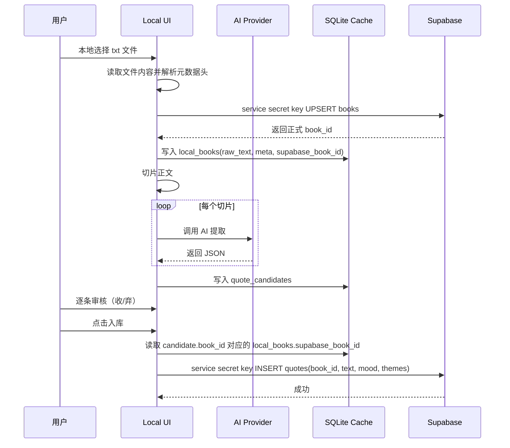
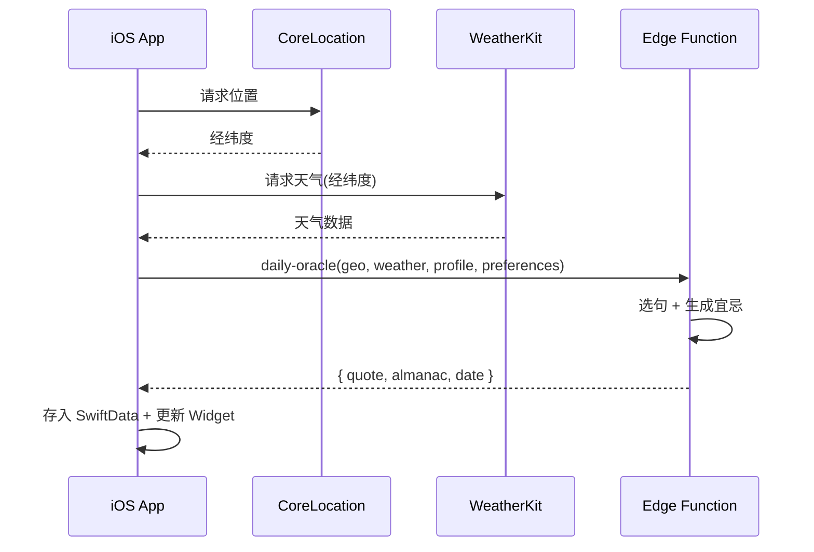
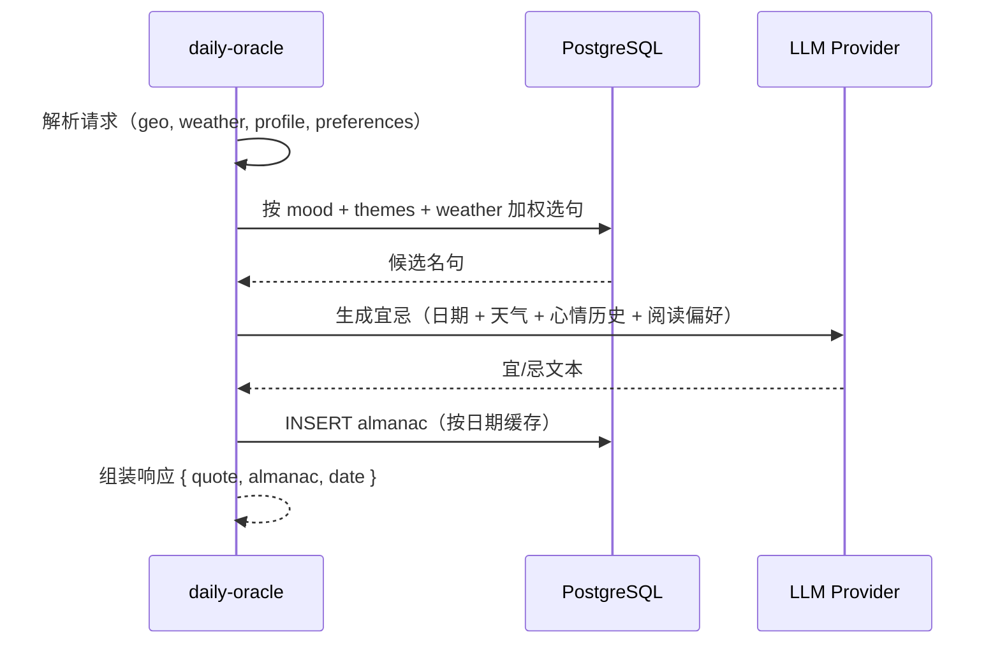

# Architecture — Daily Quote App

## 总览

系统分三层，**完全解耦**，唯一契约是数据库 schema 和 Edge Function 的请求/响应格式。

- **Local 工作台**：语料生产（书籍解析、AI 提取、人工审核），通过 `service secret key` 写入 Supabase 正式数据。
- **Supabase 业务层**：数据持久化 + 单一 Edge Function（接收客户端配置，组装每日数据包返回）。
- **Apple App（iOS / iPadOS）**：展示 + 用户交互，所有用户数据存本地（SwiftData + CloudKit 同步），通过 WeatherKit 获取天气，StoreKit 2 管理内购。

**无用户体系**：不使用 Supabase Auth。App 使用 publishable key 直连 Supabase SDK / Edge Function。用户数据（历史、配置、纪念日）全部存本地 SwiftData，通过 CloudKit 实现跨设备同步。

```
┌─────────────────────────────────────────────────────────────────────┐
│                     Layer 1: Local 工作台                            │
│  ┌──────────┐   ┌─────────────┐   ┌────────────────┐   ┌──────────┐ │
│  │ txt 解析  │──▶│ Supabase书目 │──▶│ SQLite 工作台缓存 │──▶│ 审核 UI │ │
│  │ 元数据头  │   │ books 写入   │   │ 任务/候选/日志     │   │ SvelteKit│ │
│  └──────────┘   └─────────────┘   └────────────────┘   └────┬─────┘ │
└───────────────────────────────────────────────────────────┼─────────┘
                                                            │
                                  service secret key 写入正式书目与已审核数据
                                                            ▼
┌─────────────────────────────────────────────────────────────────────┐
│                   Layer 2: Supabase 业务层                           │
│  ┌──────────────────────────────────────────────────────────────┐   │
│  │                    PostgreSQL 数据库                          │   │
│  │  books │ quotes │ almanac                                     │   │
│  └──────────────────────────────────────────────────────────────┘   │
│  ┌─────────────────────────────────────────────────────────────┐    │
│  │              Edge Function: daily-oracle                     │    │
│  │  接收客户端配置 → 选句 + 生成宜忌 → 返回每日数据包           │    │
│  └─────────────────────────────────────────────────────────────┘    │
└─────────────────────────────────────────────────────────────────────┘
                              ▲ publishable key（无用户 token）
                              │
┌─────────────────────────────┴───────────────────────────────────────┐
│                Layer 3: Apple App（iOS / iPadOS）                   │
│  ┌────────────┐   ┌────────────┐   ┌────────────┐                   │
│  │ 小组件 2×2 │   │ 长条 2×4   │   │ 大组件 4×4 │                   │
│  └────────────┘   └────────────┘   └────────────┘                   │
│  ┌──────────────────────────────────────────────────────────────┐   │
│  │ 主界面：预览 / 配置 / 日历历史 / 主题切换                      │   │
│  └──────────────────────────────────────────────────────────────┘   │
│  ┌────────────────┐   ┌────────────────┐   ┌────────────────┐       │
│  │ WeatherKit     │   │ SwiftData      │   │ CloudKit       │       │
│  │ 客户端取天气    │   │ + App Group    │   │ 跨设备同步     │       │
│  └────────────────┘   └────────────────┘   └────────────────┘       │
│  ┌────────────────┐   ┌────────────────┐                            │
│  │ StoreKit 2     │   │ CoreLocation   │                            │
│  │ 内购管理       │   │ 获取坐标       │                            │
│  └────────────────┘   └────────────────┘                            │
└─────────────────────────────────────────────────────────────────────┘
```

---

## Layer 1: Local 工作台

### 职责

- 解析带元数据头的 txt 文件
- 调用 AI 提取名句（使用 `docs/prompt-oracle.md`）
- 人工逐条审核（收/弃）
- 上传书时先将解析出的书籍元数据写入 Supabase `books`，拿到正式 `book_id`
- AI 提取配置只存在当前浏览器 `localStorage`；没有本地配置就不能发起提取
- SQLite 只保存本地工作台缓存：原文、提取任务、待审候选、审核日志，以及本地书到 Supabase `book_id` 的映射
- `收` 时通过 `service secret key` key 立即写入 Supabase `quotes`，使用正式 `book_id` 关联；`弃` 时立即删除本地待审项
- 删除书时先删除 Supabase `books`，成功后再删除本地缓存书；若该书已有关联 quotes，则删除应被拒绝
- 收或者弃都存入审核日志，用于后续分析

### 技术栈

单一 SvelteKit 项目（`server/`）：

| 依赖 | 用途 |
|------|------|
| SvelteKit | UI + 服务端路由一体化 |
| `@anthropic-ai/sdk` | AI 提取，通过 `baseURL` 接入兼容端点 |
| `better-sqlite3` | 本地待审队列 |
| TailwindCSS v3 | 样式 |
| `@supabase/supabase-js` | service secret key 写入 |

### txt 元数据头规范

上传的 txt 文件顶部预留结构化元数据，解析器自动读取。格式固定为 **`key: value` 单行**，键名为英文，**值不加引号**（冒号后整段即为值，仅做首尾空白 trim）：

```
title: 生死场
author: 萧红
year: 1935
language: zh
genre: 小说

-------------

（正文从分隔符之后开始）
```

解析规则：

- 逐行读取直到遇到 `---` 或连续 `-` 分隔符
- 仅识别键名 `title`、`author`、`year`、`language`、`genre`（大小写不敏感）；`language` 须为 Supabase 枚举：`zh`、`en`、`translated`、`other`
- 分隔符之后的全部内容作为正文，进入切片流程
- 元数据自动填充到 AI prompt 的来源信息，并作为 Supabase `books` 表与本地审核上下文的事实源
- 缺少某个字段不报错，视为空值

### 目录结构

```
server/
├── src/
│   ├── routes/
│   │   ├── +page.svelte              # 提取工作台 + 名句库 + 宜忌历史 + 审核日志
│   │   ├── +layout.svelte
│   │   └── api/
│   │       ├── extract/+server.ts    # POST: 启动后台提取 / GET: SSE 进度 / PATCH: 停止
│   │       ├── review/+server.ts     # PATCH: 单条终态审核（收即入库，弃即删除）
│   │       ├── books/+server.ts      # GET/POST: 书籍列表管理
│   │       ├── library/+server.ts    # GET/DELETE: 已入库名句库
│   │       ├── almanac/+server.ts    # GET: 宜忌历史列表
│   │       ├── review-log/+server.ts # GET: 审核日志书目汇总 / 导出单书审核记录
│   ├── lib/
│   │   ├── server/
│   │   │   ├── ai-client.ts          # Anthropic SDK 封装，支持 baseURL 兼容
│   │   │   ├── chunker.ts            # 文本按段落切片
│   │   │   ├── parser.ts             # txt 元数据解析 + AI JSON 输出解析 + mood 过滤
│   │   │   ├── db.ts                 # SQLite 操作（local_books/runs/candidates/review_log）
│   │   │   ├── supabase.ts           # Supabase service secret key 写入客户端
│   │   │   ├── extractor.ts          # 后台并发提取执行器
│   │   │   ├── extraction-jobs.ts    # 任务调度 + 进度订阅发布
│   │   │   ├── extraction-control.ts # 运行中任务的中止控制（AbortController）
│   │   │   ├── quote-verifier.ts     # 收录前原文存在性校验（防 AI 编造）
│   │   │   ├── logger.ts             # 结构化日志（info/error）
│   │   │   └── env.ts                # 环境变量读取封装
│   │   ├── components/
│   │   │   ├── QuoteCard.svelte      # 名句卡片组件
│   │   │   └── NotificationViewport.svelte  # 通知提示组件
│   │   ├── types.ts                  # TypeScript 类型定义
│   │   ├── notifications.ts          # 前端通知工具
│   │   └── extraction-progress.ts    # 进度条计算工具
│   └── app.html
├── data/
│   └── queue.db                      # SQLite 工作台缓存（WAL 模式）
├── package.json
├── svelte.config.js
├── tailwind.config.js
├── postcss.config.cjs
├── tsconfig.json
└── vite.config.ts
```

### 提取流程

```
本地读取 txt 文件
    │
    ▼
解析元数据头 → title/author/year/language/genre
    │
    ▼
分隔符后正文 → chunker 按段落边界切片
    │
    ▼
POST /api/extract 立即创建批次并启动后台任务
  - 前端不等待整本书同步返回
  - 上传阶段先将书籍元数据写入 Supabase `books`，拿到正式 `book_id`
  - 本地 SQLite `local_books` 保存 `supabase_book_id` 映射与原始正文
  - 当前书目若已有 queued/running 批次，则拒绝重复启动
  - 后台任务通过 extraction-jobs.ts 调度，支持多 worker 并发
    │
    ▼
后台并发调用 AI
  - 每片独立请求（worker 池 = concurrency 配置）
  - 失败不重试（记录到 failedChunks）
  - GET /api/extract?stream=1 通过 SSE 推送真实进度到前端
  - PATCH /api/extract 可中止运行中的批次（AbortController）
  - 服务端控制台打印：分片调度、模型输入输出、错误日志
    │
    ▼
解析 AI 返回的 JSON 数组
  - 过滤 <think> 标签
  - 保留提取出的名句正文；moods/themes 仅作为补充标签，缺失时不丢弃候选
  - moods 只允许保留 `server/supabase/schema.sql` 中 `quote_mood` 枚举支持的值
  - 句子候选写入本地 SQLite `quote_candidates`
  - 候选关联本地 `local_books.id`；审核通过时再通过 `local_books.supabase_book_id` 关联 Supabase `books`
    │
    ▼
写入 SQLite queue.db（工作台缓存）
  - `local_books` 保存原文与 `supabase_book_id`
  - `quote_candidates` 使用 unique index (`book_id`, `normalized_text`) 去重
    │
    ▼
待审清单展示 → 人工逐条审核（收/弃）
  - 收录前服务端必须用候选句的归一化文本去原始正文做一次存在性校验
  - 收：通过 `candidate.book_id -> local_books.supabase_book_id` 找到正式 `book_id`，写入 Supabase `quotes`
  - 弃：立即从本地待审清单删除
```

### 后台任务调度

- `extraction-jobs.ts` 维护活跃任务 Map，支持：
  - 任务状态订阅（发布/订阅模式）
  - SSE 流推送进度到前端
  - 页面刷新后恢复进度订阅
- `extraction-control.ts` 管理任务中止：
  - 每个任务维护 AbortController 集合
  - 停止时批量 abort 所有进行中请求
  - 进度冻结在停止时的 chunk 位置

### AI 客户端配置

使用 `@anthropic-ai/sdk`，通过 `baseURL` 兼容任何 Anthropic Messages API 兼容端点。当前实现将提示词模板作为 `system` prompt，下发给模型；分片正文和来源信息作为单条 `user` message：

```typescript
import Anthropic from '@anthropic-ai/sdk';

const client = new Anthropic({
  apiKey: config.apiKey,
  baseURL: config.baseURL, // 留空则走官方 endpoint
});

const response = await client.messages.create({
  model: config.model,
  max_tokens: 4096, // 固定值，不在 UI / 环境变量中配置
  temperature: config.temperature,
  top_p: config.topP,
  system: prompt,
  messages: [{ role: 'user', content: userContent }],
});
```

配置示例（`.env`）：

```
API_BASE_URL=https://open.bigmodel.cn/api/paas/v4
API_KEY=your-key
MODEL=glm-5.1
CHUNK_SIZE=4000
CONCURRENCY=3
TEMPERATURE=0.3
TOP_P=0.9

# Supabase（2026-03 起使用新版 key，legacy anon/service secret key 已废弃）
SUPABASE_URL=https://xxx.supabase.co
PUBLISHABLE_KEY=sb_publishable_xxx
SERVICE_SECRET_KEY=sb_secret_xxx
```

说明：

- 当前实现使用非 streaming `messages.create`；`max_tokens` 固定为 `4096`（与兼容网关的非流式输出上限一致；不在工作台配置）；不发送 `top_k`，由服务端默认

### UI 页面

**提取工作台**（`+page.svelte`）：

- 四 Tab 结构：提取 / 名句库 / 宜忌 / 审核日志
- 提取 Tab：
  - 左栏：支持多模型提供商切换（每个独立保存 API URL / 模型 / API Key / 采样参数 / Prompt）
  - 快捷复制按钮（API URL、模型、API Key）
  - 参数配置：切片大小、并发数、Temperature、Top P、Prompt 编辑器
  - 右栏：txt 上传、已选书籍卡片、清空结果、删除书籍、提取进度条、开始/停止按钮
  - 状态机：IDLE / QUEUED / RUNNING / DONE / PARTIAL / STOPPED / ERROR
  - SSE 进度订阅：刷新页面后自动恢复运行中任务的进度推送
  - 停止时进度冻结，避免中止阶段进度回跳
- 名句库 Tab：
  - 已入库名句列表（分页）
  - 筛选器：作者、心情、主题
  - 手动删除（软删除 `is_active = false`）
- 宜忌 Tab：
  - 今日宜忌卡片（天气、温度、生成信号）
  - 历史宜忌列表
- 审核日志 Tab：
  - 按书展示审核汇总：总数、收录数、丢弃数、最后决策时间
  - 支持导出单本书的审核日志 JSON

**待审清单**（集成在提取 Tab）：

- 顶部 filter：全部 / 待处理
- 每条展示：名句全文、作者·作品·年份·体裁、mood tags、themes tags
- 操作：收（入库）/ 弃（删除）
- 终态设计：收即入库并移除，弃即删除并移除

**数据库结构**：

| 表 | 用途 |
|----|------|
| `local_books` | 本地工作台书缓存（含 rawText、元数据、`supabase_book_id` 映射） |
| `extraction_runs` | 提取批次记录（状态、进度、配置快照） |
| `quote_candidates` | 待审名句候选（关联 `local_books`，含归一化文本去重） |
| `review_log` | 审核终态日志（收/弃决策明细与导出） |

---

## Layer 2: Supabase 业务层

### 数据库

完整 schema 见 `server/supabase/schema.sql`，核心表：

| 表 | 用途 |
|----|------|
| `books` | 正式书目元数据；上传 txt 解析成功后即写入 |
| `quotes` | 已审核名句库；通过 `book_id` 关联书目 |
| `almanac` | 每日宜忌（按日期缓存，作为生成记录） |

说明：

- Supabase 不再保存提取过程批次表；提取任务状态、候选队列、审核日志属于本地工作台职责
- `books` 属于正式语料目录，即使句子尚未审核入库，也可以先作为书目事实源存在 Supabase
- `quotes` 不重复保存书级事实字段；展示时通过 `book_id` join `books`

### Edge Function: daily-oracle

**请求格式**：

```json
{
  "geo": { "lng": 113.26, "lat": 23.13 },
  "weather": { "temperature": 28, "condition": "sunny", "wind": 3 },
  "profile": { "lang": "zh", "region": "CN", "pro": true },
  "preferences": {
    "mood": "calm",
    "mood_history": ["calm", "sad", "sad", "anxious", "calm", "happy", "calm"],
    "genre_history": ["哲学", "古典", "小说", "诗歌", "小说", "散文", "哲学"]
  }
}
```

| 字段 | 说明 |
|------|------|
| `geo` | 经纬度坐标（CoreLocation） |
| `weather` | 天气数据（WeatherKit，客户端获取） |
| `profile` | 用户基础信息（语言、地区、是否付费） |
| `preferences` | 扩展配置（心情、历史偏好等，未来新增字段放这里） |

**处理逻辑**：

1. 解析请求参数
2. 根据 mood + themes + weather + 日期信号加权评分，从 `quotes` 表选句
3. 调用 LLM 生成宜忌（使用 `docs/prompt-yi.md`，prompt 硬编码在函数内）
4. 将宜忌按日期写入 `almanac`（缓存记录）
5. 组装数据包返回

**响应格式**：

```json
{
  "quote": {
    "id": "uuid",
    "text": "原文",
    "author": "作者",
    "work": "作品",
    "year": 1984,
    "mood": ["calm", "philosophical"],
    "themes": ["孤独", "自由"]
  },
  "almanac": {
    "yi": "宜：在自然光下读几页纸质书",
    "ji": "忌：把休息当成需要被证明才能拥有的东西"
  },
  "date": "2026-04-02"
}
```

**关键设计**：

- 天气数据仅用于服务端判断（选句加权 + 宜忌生成信号），不回传给客户端
- Edge Function 对 `preferences` 中未知字段直接忽略，保证向后兼容
- App 对响应中缺失字段给默认值，保证向前兼容

### themes 加权评分查询策略

名句入库时 AI 输出 `themes[]` 语义主题词（如 `["离别", "雨", "父子", "秋"]`），查询时通过主题词加权评分实现软匹配。

**核心逻辑**：

1. 天气描述 → 主题词：从客户端传来的天气数据解析关键词
   - "sunny 28℃" → `["晴", "夏"]`
   - "snow -5℃" → `["雪", "冬"]`

2. 节日/纪念日 → 主题词：维护映射表
   - 父亲节 → `["父子", "亲情"]`
   - 中秋 → `["月", "团圆", "思乡"]`

3. 评分 SQL 示例：

```sql
-- 父亲节当天，用户心情 calm，天气小雨
select *,
  (case when themes @> array['父子'] then 3 else 0 end
   + case when themes @> array['亲情'] then 2 else 0 end
   + case when themes @> array['雨'] then 1 else 0 end
  ) as score
from quotes
where is_active = true
  and mood @> array['calm']::quote_mood[]
order by score desc, random()
limit 5;
```

**关键设计**：

- 软匹配，不硬过滤：有主题词命中则加分，没命中也能返回结果
- 映射表有限可控：几十个节日 + 常见天气词，一次性维护
- 避免预打标签的不准确：天气/节日不存入名句，运行时动态评分

### RLS 策略

| 表 | 策略 |
|----|------|
| books | publishable key 公开只读 |
| quotes | publishable key 公开只读（is_active = true） |
| almanac | publishable key 公开只读 |
| books / quotes / almanac | 仅 service secret key 可写 |

### 视图

**v_quote_by_mood**：按心情随机取一条，包含句子字段与关联书目信息 `book_id, title, author, year, genre, lang`

**v_corpus_stats**：库存统计（总数、按语言）

---

## Layer 3: Apple App 展示层（iOS / iPadOS）

### 多平台策略

一个 Xcode 项目、一个 App target，同时支持 iOS 与 iPadOS，通过通用 SwiftUI 布局适配不同尺寸。

**开发节奏**：先完成 iPhone 主线，再适配 iPad 布局，不扩展到 macOS 或 Catalyst。

**共享层（两端通用）**：
- 业务逻辑、数据层（SwiftData + CloudKit）、网络层（Supabase SDK + WeatherKit）、StoreKit 2
- 大部分 SwiftUI 视图代码

**平台差异层（`#if os()` 条件编译）**：
- iPadOS：多栏布局优化、键盘快捷键、拖拽支持
- Widget：同一份 Widget 代码覆盖 iPhone / iPad，按尺寸族适配布局

**最低版本**：
- iOS / iPadOS：17.6

### 职责

- 每日自动更新展示名句、宜忌
- 用户心情选择（8 种：calm, happy, sad, anxious, angry, resilient, romantic, philosophical），触发换匹配名句 + 更新宜忌
- 日历历史视图
- 主题切换
- 小组件数据同步
- 纪念日管理（本地 SwiftData）

### 用户数据存储

**无服务端用户体系**。所有用户数据存本地：

| 存储方式 | 数据 |
|---------|------|
| SwiftData | 每日记录（心情、名句、宜忌）、纪念日、App 配置、历史数据 |
| App Group UserDefaults | 轻量标志位（lastFetchDate、当日缓存） |
| CloudKit | SwiftData 自动同步，跨设备共享 |

### 内购（StoreKit 2）

纯客户端验证，使用 `Transaction.currentEntitlements` 检查购买状态。

付费功能全部是客户端体验层，不涉及服务端数据权限差异：

- 个性组件和 App Icon
- 纪念日管理
- 日历主题（粤语歌、电影、作家等）
- 自定义字体

### 天气（WeatherKit）

客户端直接使用 Apple WeatherKit 获取天气数据，传给 Edge Function 作为选句和宜忌生成的信号。

### 权限

- **CoreLocation**：请求位置权限（`whenInUse`），获取经纬度坐标
- **WeatherKit**：基于位置获取天气
- 首次启动引导授权，拒绝后降级为手动选择城市

### 小组件三尺寸

| 尺寸 | 内容 |
|------|------|
| 小 2×2 | 名句 + 出处 |
| 横条 4×2 | 名句 + 出处，底部显示宜忌| 如果文字太长，则仅显示一条宜/忌
| 大 4×4 |  名句、出处、宜忌各一条、心情选择条（8格）|

### 小组件每日自动更新

**触发机制**：

1. **WidgetKit Timeline**：`TimelineProvider` 返回 `.atEnd` 策略，系统在 timeline 耗尽时自动请求新数据
2. **每日午夜刷新**：timeline 包含一个 entry，`date` 设为次日 05:00，系统到时自动刷新
3. **App 主动触发**：用户在 App 内操作（切换心情、刷新名句）后调用 `WidgetCenter.shared.reloadAllTimelines()`

**TimelineProvider 实现要点**：

```swift
struct QuoteTimelineProvider: TimelineProvider {
    func getTimeline(in context: Context, completion: @escaping (Timeline<QuoteEntry>) -> Void) {
        Task {
            // 1. 从 App Group UserDefaults 读取缓存数据
            // 2. 如果缓存过期或不存在，调用 Edge Function daily-oracle
            // 3. 计算下次刷新时间（次日 05:00）
            let nextUpdate = Calendar.current.startOfDay(for: Date()).addingTimeInterval(86400)
            let entry = QuoteEntry(date: Date(), quote: quote, almanac: almanac)
            let timeline = Timeline(entries: [entry], policy: .after(nextUpdate))
            completion(timeline)
        }
    }
}
```

**数据同步流程**：

```
App Group UserDefaults
    ├── todayQuote: 当日名句 JSON
    ├── todayAlmanac: 当日宜忌 JSON
    ├── lastFetchDate: 上次拉取日期
    └── userMood: 用户当前心情

App 启动 / 后台刷新
    │
    ├── 检查 lastFetchDate != 今天？
    │       ├── 是 → WeatherKit 取天气 → 获取坐标 → 调用 daily-oracle(geo, weather, profile, preferences) → 更新缓存
    │       └── 否 → 使用缓存
    │
    └── WidgetCenter.shared.reloadAllTimelines()

Widget Timeline Provider
    │
    └── 读取 App Group UserDefaults → 渲染 Entry
```

**后台刷新**：

- App 注册 `BGAppRefreshTask`，系统在合适时机唤醒 App 拉取新数据
- Widget 的 `getTimeline` 也可直接调用网络（需处理超时，WidgetKit 限制 ~15s）

### 主界面功能

- 预览当前小组件外观（实时效果）
- 配置显示内容（心情筛选、刷新名句）
- 日期显示 / 天气展示（WeatherKit 数据）/ 主题切换
- 心情选择 → 触发换匹配名句
- **日历视图**：按月查看历史，每天显示当日名句/心情/宜忌

### 数据架构

| 组件 | 用途 |
|------|------|
| Supabase Swift SDK | 调用 Edge Function（publishable key，无用户 token） |
| WeatherKit | 获取天气数据，传给 Edge Function |
| CoreLocation | 获取经纬度坐标 |
| SwiftData | 本地持久化（历史、配置、纪念日），App Group container 共享 |
| CloudKit | SwiftData 自动同步，跨设备 |
| StoreKit 2 | 内购验证（客户端本地） |
| App Group | 共享 UserDefaults，App ↔ Widget 数据传递 |
| WidgetKit | timeline provider 定时刷新 + `WidgetCenter.shared.reloadTimelines` |

本地缓存策略：缓存当日数据，离线可用。

---

## 数据流时序图

### 名句入库流程



### App 每日加载流程



### 宜忌生成流程（Edge Function 内部）



---

## 开发约定

- pnpm 管理 JS 依赖
- SvelteKit + TailwindCSS v3（Local 工作台）
- Swift/SwiftUI（iOS / iPadOS）
- 避免 `pnpm dev` 启动服务器
- 避免 xcodebuild（仅打包时用）
- 三层完全解耦，通过数据库 schema 和接口格式联调
- 代码需要测试覆盖

---

## 模型接入

只需修改环境变量，无需改代码：
| 模型 | baseURL | model |
| kimi | <https://api.moonshot.cn/anthropic> | kimi-2.5 |
| GLM / 智谱 | <https://open.bigmodel.cn/api/paas/v4> | glm-5.1 |
