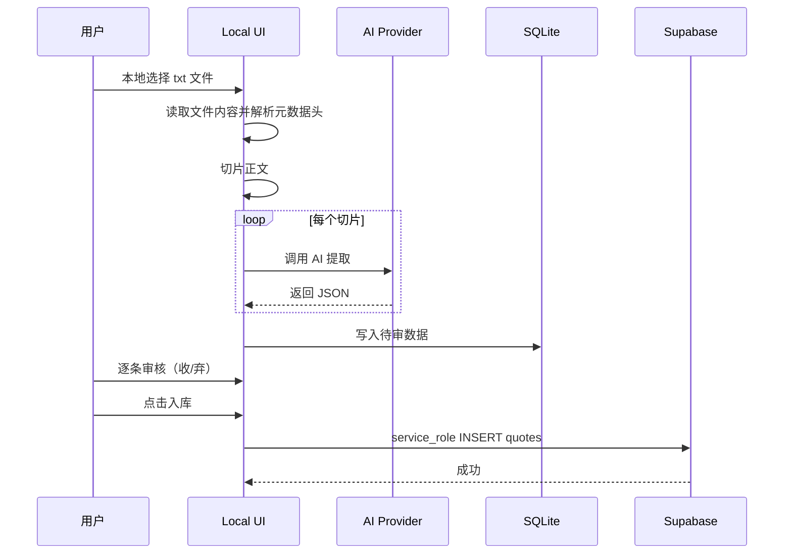
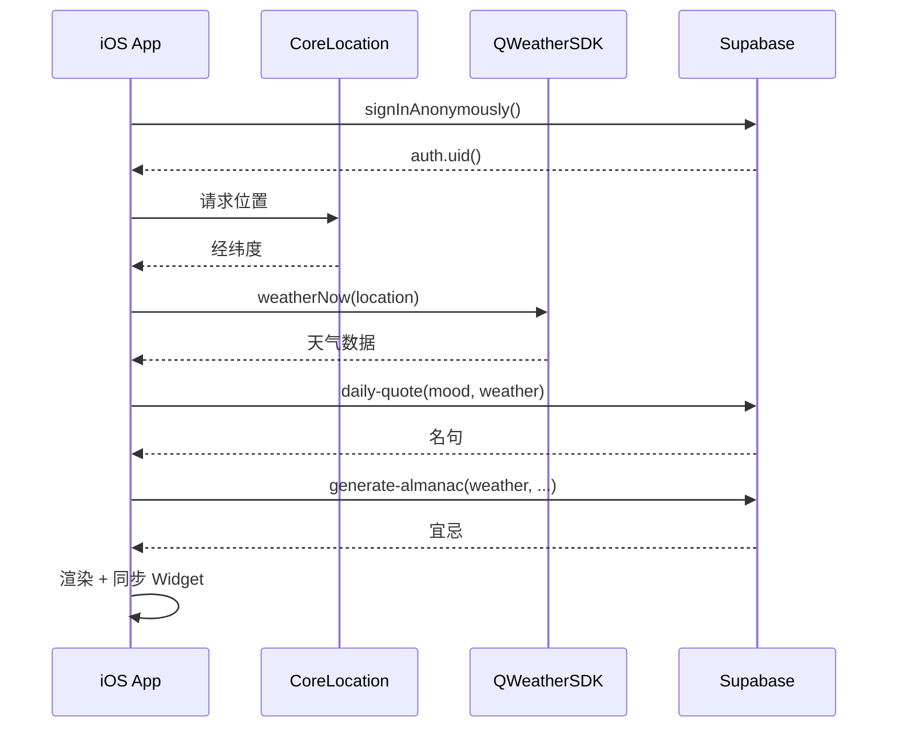
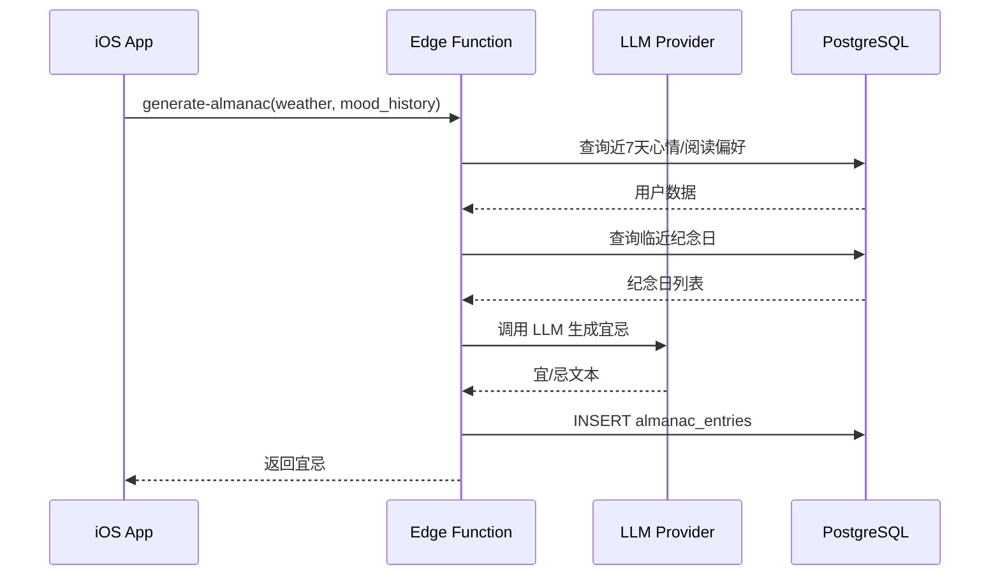

# Architecture — Daily Quote App

## 总览

系统分三层：**Local 工作台**负责语料生产（书籍解析、AI 提取、人工审核）；**Supabase 业务层**提供数据持久化和面向 App 的业务逻辑；**iOS App**纯展示 + 用户交互。

```
┌─────────────────────────────────────────────────────────────────────┐
│                     Layer 1: Local 工作台                            │
│  ┌──────────┐   ┌─────────────┐   ┌─────────────┐   ┌────────────┐  │
│  │ txt 解析  │──▶│  AI 提取    │──▶│ SQLite 队列 │──▶│ 审核管理 UI │  │
│  │ 元数据头  │   │ Anthropic   │   │ 待审数据    │   │ SvelteKit  │  │
│  └──────────┘   └─────────────┘   └─────────────┘   └─────┬──────┘  │
└───────────────────────────────────────────────────────────┼─────────┘
                                                            │
                                      service_role 写入已审核数据
                                                            ▼
┌─────────────────────────────────────────────────────────────────────┐
│                   Layer 2: Supabase 业务层                           │
│  ┌──────────────────────────────────────────────────────────────┐   │
│  │                    PostgreSQL 数据库                          │   │
│  │  quotes │ extraction_batches │ almanac_entries │ user_daily_logs │
│  │  anniversaries                                                │   │
│  └──────────────────────────────────────────────────────────────┘   │
│  ┌─────────────────┐   ┌─────────────────┐   ┌─────────────────┐    │
│  │ Edge Function   │   │ Edge Function   │   │ Edge Function   │    │
│  │ daily-quote     │   │ generate-almanac│   │ log-mood        │    │
│  └─────────────────┘   └─────────────────┘   └─────────────────┘    │
│                              ▲ pg_cron 每日触发                      │
└─────────────────────────────┬───────────────────────────────────────┘
                              │ anon key 只读
                              ▼
┌─────────────────────────────────────────────────────────────────────┐
│                    Layer 3: iOS App 展示层                           │
│  ┌────────────┐   ┌────────────┐   ┌────────────┐                   │
│  │ 小组件 2×2 │   │ 长条 2×4   │   │ 大组件 4×4 │                   │
│  └────────────┘   └────────────┘   └────────────┘                   │
│  ┌──────────────────────────────────────────────────────────────┐   │
│  │ 主界面：预览 / 配置 / 日历历史 / 纪念日 / 主题切换            │   │
│  └──────────────────────────────────────────────────────────────┘   │
│  ┌────────────────┐   ┌────────────────┐                            │
│  │ QWeatherSDK    │   │ App Group      │                            │
│  │ + CoreLocation │   │ Widget 数据共享 │                            │
│  └────────────────┘   └────────────────┘                            │
└─────────────────────────────────────────────────────────────────────┘
```

---

## Layer 1: Local 工作台

### 职责

- 解析带元数据头的 txt 文件
- 调用 AI 提取名句（使用 `docs/prompt-oracle.md`）
- 人工逐条审核（收/弃）
- `收` 时通过 `service_role` key 立即写入 Supabase，`弃` 时立即删除本地待审项

### 技术栈

单一 SvelteKit 项目（`server/`）：

| 依赖 | 用途 |
|------|------|
| SvelteKit | UI + 服务端路由一体化 |
| `@anthropic-ai/sdk` | AI 提取，通过 `baseURL` 接入兼容端点 |
| `better-sqlite3` | 本地待审队列 |
| TailwindCSS v3 | 样式 |
| `@supabase/supabase-js` | service_role 写入 |

### txt 元数据头规范

上传的 txt 文件顶部预留结构化元数据，解析器自动读取：

```
"title": "一九八四",
"author": "乔治奥威尔",
"year": 1986,
"language": "中文",
"genre": "小说"
-------------

（正文从分隔符之后开始）
```

解析规则：

- 逐行读取直到遇到 `---` 或连续 `-` 分隔符
- 按 JSON 风格的 `key: value` 行提取元数据（`title`、`author`、`year`、`language`、`genre`）
- 分隔符之后的全部内容作为正文，进入切片流程
- 元数据自动填充到 AI prompt 的来源信息，并作为最终入库的 `lang`/`source_book`/`author`/`year`/`genre` 字段事实源
- 缺少某个字段不报错，视为空值

### 目录结构

```
server/
├── src/
│   ├── routes/
│   │   ├── +page.svelte              # 提取工作台 + 名句库 + 宜忌历史
│   │   ├── +layout.svelte
│   │   └── api/
│   │       ├── extract/+server.ts    # POST: 启动后台提取 / GET: SSE 进度 / PATCH: 停止
│   │       ├── review/+server.ts     # PATCH: 单条终态审核（收即入库，弃即删除）
│   │       ├── books/+server.ts      # GET/POST: 书籍列表管理
│   │       ├── library/+server.ts    # GET/DELETE: 已入库名句库
│   │       ├── almanac/+server.ts    # GET: 宜忌历史列表
│   │       └── config/+server.ts     # GET/POST: AI 配置持久化
│   ├── lib/
│   │   ├── server/
│   │   │   ├── ai-client.ts          # Anthropic SDK 封装，支持 baseURL 兼容
│   │   │   ├── chunker.ts            # 文本按段落切片
│   │   │   ├── parser.ts             # txt 元数据解析 + AI JSON 输出解析 + mood 过滤
│   │   │   ├── db.ts                 # SQLite 操作（books/runs/candidates/config）
│   │   │   ├── supabase.ts           # Supabase service_role 写入客户端
│   │   │   ├── extractor.ts          # 后台并发提取执行器
│   │   │   ├── extraction-jobs.ts    # 任务调度 + 进度订阅发布
│   │   │   ├── extraction-control.ts # 运行中任务的中止控制（AbortController）
│   │   │   ├── quote-verifier.ts     # 收录前原文存在性校验（防 AI 编造）
│   │   │   ├── config.ts             # 配置管理（env + SQLite 持久化）
│   │   │   ├── logger.ts             # 结构化日志（info/error）
│   │   │   └── env.ts                # 环境变量读取封装
│   │   ├── components/
│   │   │   ├── QuoteCard.svelte      # 名句卡片组件
│   │   │   └── NotificationViewport.svelte  # 通知提示组件
│   │   ├── types.ts                  # TypeScript 类型定义
│   │   ├── notifications.ts          # 前端通知工具
│   │   └── extraction-progress.ts    # 进度条计算工具
│   └── app.html
├── data/
│   └── queue.db                      # SQLite 待审数据（WAL 模式）
├── package.json
├── svelte.config.js
├── tailwind.config.js
├── postcss.config.cjs
├── tsconfig.json
└── vite.config.ts
```

### 提取流程

```
本地读取 txt 文件
    │
    ▼
解析元数据头 → title/author/year/language/genre
    │
    ▼
分隔符后正文 → chunker 按段落边界切片
    │
    ▼
POST /api/extract 立即创建批次并启动后台任务
  - 前端不等待整本书同步返回
  - 当前书目若已有 queued/running 批次，则拒绝重复启动
  - 后台任务通过 extraction-jobs.ts 调度，支持多 worker 并发
    │
    ▼
后台并发调用 AI
  - 每片独立请求（worker 池 = concurrency 配置）
  - 失败不重试（记录到 failedChunks）
  - GET /api/extract?stream=1 通过 SSE 推送真实进度到前端
  - PATCH /api/extract 可中止运行中的批次（AbortController）
  - 服务端控制台打印：分片调度、模型输入输出、错误日志
    │
    ▼
解析 AI 返回的 JSON 数组
  - 过滤 <think> 标签
  - 保留提取出的名句正文；moods/themes 仅作为补充标签，缺失时不丢弃候选
  - moods 只允许保留 docs/schema.sql 中 quote_mood 枚举支持的值
  - lang/author/work/year/genre 等元数据，统一从 txt 元数据头回填
    │
    ▼
写入 SQLite queue.db（待审状态）
  - 使用 unique index (book_id, normalized_text) 去重
    │
    ▼
待审清单展示 → 人工逐条审核（收/弃）
  - 收录前服务端必须用候选句的归一化文本去原始正文做一次存在性校验
  - 收：立即写入 Supabase quotes 表，并从本地待审清单移除
  - 弃：立即从本地待审清单删除
```

### 后台任务调度

- `extraction-jobs.ts` 维护活跃任务 Map，支持：
  - 任务状态订阅（发布/订阅模式）
  - SSE 流推送进度到前端
  - 页面刷新后恢复进度订阅
- `extraction-control.ts` 管理任务中止：
  - 每个任务维护 AbortController 集合
  - 停止时批量 abort 所有进行中请求
  - 进度冻结在停止时的 chunk 位置

### AI 客户端配置

使用 `@anthropic-ai/sdk`，通过 `baseURL` 兼容任何 Anthropic Messages API 兼容端点：

```typescript
import Anthropic from '@anthropic-ai/sdk';

const client = new Anthropic({
  apiKey: config.apiKey,
  baseURL: config.baseURL, // 留空则走官方 endpoint
});

const response = await client.messages.create({
  model: config.model,
  max_tokens: config.maxTokens,
  temperature: config.temperature,
  top_p: config.topP,
  top_k: config.topK,
  messages: [
    { role: 'user', content: `${prompt}\n\n## 待处理文本\n${chunk}` }
  ],
});
```

配置示例（`.env`）：

```
API_BASE_URL=https://open.bigmodel.cn/api/paas/v4
API_KEY=your-key
MODEL=glm-4.7
CHUNK_SIZE=4000
CONCURRENCY=3
TEMPERATURE=0.3
TOP_P=0.9
TOP_K=50
MAX_TOKENS=4096
```

说明：

- 当前实现使用非 streaming `messages.create`；`max_tokens` 必须控制在 Anthropic SDK 的 10 分钟非流式超时保护阈值内
- 默认 `MAX_TOKENS` 为 `4096`；如果配置值过大，服务端会在发请求前自动收敛到安全上限，避免整个提取批次在本地被 SDK 直接拒绝

### UI 页面

**提取工作台**（`+page.svelte`）：

- 三 Tab 结构：提取 / 名句库 / 宜忌
- 提取 Tab：
  - 左栏：支持多模型提供商切换（每个独立保存 API URL / 模型 / API Key / 采样参数 / Prompt）
  - 快捷复制按钮（API URL、模型、API Key）
  - 参数配置：切片大小、并发数、Temperature、Top P、Top K、Max Tokens、Prompt 编辑器
  - 右栏：txt 上传、已选书籍卡片、清空结果、删除书籍、提取进度条、开始/停止按钮
  - 状态机：IDLE / QUEUED / RUNNING / DONE / PARTIAL / STOPPED / ERROR
  - SSE 进度订阅：刷新页面后自动恢复运行中任务的进度推送
  - 停止时进度冻结，避免中止阶段进度回跳
- 名句库 Tab：
  - 已入库名句列表（分页）
  - 筛选器：作者、心情、主题
  - 手动删除（软删除 `is_active = false`）
- 宜忌 Tab：
  - 今日宜忌卡片（天气、温度、生成信号）
  - 历史宜忌列表

**待审清单**（集成在提取 Tab）：

- 顶部 filter：全部 / 待处理
- 每条展示：名句全文、作者·作品·年份·体裁、mood tags、themes tags
- 操作：收（入库）/ 弃（删除）
- 终态设计：收即入库并移除，弃即删除并移除

**数据库结构**：

| 表 | 用途 |
|----|------|
| `books` | 已上传的书籍（含 rawText 和元数据） |
| `extraction_runs` | 提取批次记录（状态、进度、配置快照） |
| `quote_candidates` | 待审名句候选（含归一化文本去重） |
| `app_config` | AI 配置持久化（多提供商配置） |

---

## Layer 2: Supabase 业务层

### 数据库

完整 schema 见 `docs/schema.sql`，核心表：

| 表 | 用途 |
|----|------|
| `quotes` | 已审核名句库 |
| `extraction_batches` | 提取批次元数据 |
| `almanac_entries` | 每日宜忌 |
| `user_daily_logs` | 用户每日记录（心情、名句、宜忌） |
| `anniversaries` | 用户纪念日 |

### 用户身份

使用 **Supabase Anonymous Auth**：

- App 启动时调用 `supabase.auth.signInAnonymously()`
- 自动获得 `auth.uid()`，无需登录 UI
- 所有用户相关表用 `user_id uuid references auth.users(id)`
- RLS 用 `auth.uid()` 限制访问
- 将来可升级为 Apple Sign In / 邮箱账号，数据不丢失

### Edge Functions

**daily-quote**：

- App 请求今日名句
- 按心情 + themes 加权评分查询（见下方策略）
- 避免连续重复

**generate-almanac**：

- 调用 LLM 生成宜忌（使用 `docs/prompt-yi.md`）
- 输入信号：日期、天气描述（原始文本）、近7天心情/阅读偏好、临近纪念日
- 通过 auth token 获取 user_id 查询用户数据

**log-mood**：

- 记录用户每日心情选择
- 更新 `user_daily_logs`

### themes 加权评分查询策略

名句入库时 AI 输出 `themes[]` 语义主题词（如 `["离别", "雨", "父子", "秋"]`），查询时通过主题词加权评分实现软匹配。

**核心逻辑**：

1. 天气描述 → 主题词：从天气 API 原始文本解析关键词
   - "小雨 17℃" → `["雨"]`
   - "大雪 -5℃" → `["雪", "冬"]`

2. 节日/纪念日 → 主题词：维护映射表
   - 父亲节 → `["父子", "亲情"]`
   - 中秋 → `["月", "团圆", "思乡"]`
   - 用户纪念日"结婚纪念日" → `["爱情", "婚姻"]`

3. 评分 SQL 示例：

```sql
-- 父亲节当天，用户心情 calm，天气小雨
select *,
  (case when themes @> array['父子'] then 3 else 0 end
   + case when themes @> array['亲情'] then 2 else 0 end
   + case when themes @> array['雨'] then 1 else 0 end
  ) as score
from quotes
where is_active = true
  and mood @> array['calm']::quote_mood[]
order by score desc, random()
limit 5;
```

**关键设计**：

- 软匹配，不硬过滤：有主题词命中则加分，没命中也能返回结果
- 映射表有限可控：几十个节日 + 常见天气词，一次性维护
- 避免预打标签的不准确：天气/节日不存入名句，运行时动态评分

### RLS 策略

| 表 | 策略 |
|----|------|
| quotes | anon 公开只读（is_active = true） |
| almanac_entries | anon 公开只读 |
| extraction_batches | 仅 service_role |
| user_daily_logs | `user_id = auth.uid()` |
| anniversaries | `user_id = auth.uid()` |

### 视图

**v_quote_by_mood**：按心情随机取一条，包含 `id, text, lang, author, work, year, genre, mood, themes`

**v_corpus_stats**：库存统计（总数、按语言）

---

## Layer 3: iOS App 展示层

### 职责

- 每日自动更新展示名句、宜忌
- 用户心情选择，触发换匹配名句 + 更新宜忌
- 日历历史视图
- 纪念日管理
- 主题切换
- 小组件数据同步

### 权限

- **CoreLocation**：请求位置权限（`whenInUse`），获取经纬度查天气
- 首次启动引导授权，拒绝后降级为手动选择城市

### 和风天气集成

参考 `docs/qwd和风/`：

- 使用 QWeatherSDK（Swift Package Manager 集成）
- JWT 认证（Ed25519 私钥签名）
- 调用 `weatherNow` 获取实时天气
- 天气数据用途：1) 界面展示 2) 作为宜忌生成信号

```swift
// 示例
let parameter = WeatherParameter(location: locationId)
let response = try await QWeather.instance.weatherNow(parameter)
```

### 小组件三尺寸

| 尺寸 | 内容 |
|------|------|
| 小 2×2 | 仅名句全文，无出处无宜忌 |
| 长条 2×4 | 名句 + 出处，底部显示宜或忌其中一条（交替） |
| 大 4×4 | 完整版：名句、出处、宜忌各一条、心情选择条（5格）|

### 小组件每日自动更新

**触发机制**：

1. **WidgetKit Timeline**：`TimelineProvider` 返回 `.atEnd` 策略，系统在 timeline 耗尽时自动请求新数据
2. **每日午夜刷新**：timeline 包含一个 entry，`date` 设为次日 05:00，系统到时自动刷新
3. **App 主动触发**：用户在 App 内操作（切换心情、刷新名句）后调用 `WidgetCenter.shared.reloadAllTimelines()`

**TimelineProvider 实现要点**：

```swift
struct QuoteTimelineProvider: TimelineProvider {
    func getTimeline(in context: Context, completion: @escaping (Timeline<QuoteEntry>) -> Void) {
        Task {
            // 1. 从 App Group UserDefaults 读取缓存数据
            // 2. 如果缓存过期或不存在，调用 Supabase daily-quote
            // 3. 计算下次刷新时间（次日 05:00）
            let nextUpdate = Calendar.current.startOfDay(for: Date()).addingTimeInterval(86400)
            let entry = QuoteEntry(date: Date(), quote: quote, almanac: almanac)
            let timeline = Timeline(entries: [entry], policy: .after(nextUpdate))
            completion(timeline)
        }
    }
}
```

**数据同步流程**：

```
App Group UserDefaults
    ├── todayQuote: 当日名句 JSON
    ├── todayAlmanac: 当日宜忌 JSON  
    ├── lastFetchDate: 上次拉取日期
    └── userMood: 用户当前心情

App 启动 / 后台刷新
    │
    ├── 检查 lastFetchDate != 今天？
    │       ├── 是 → 调用 daily-quote + generate-almanac → 更新 UserDefaults
    │       └── 否 → 使用缓存
    │
    └── WidgetCenter.shared.reloadAllTimelines()

Widget Timeline Provider
    │
    └── 读取 App Group UserDefaults → 渲染 Entry
```

**后台刷新**：

- App 注册 `BGAppRefreshTask`，系统在合适时机唤醒 App 拉取新数据
- Widget 的 `getTimeline` 也可直接调用网络（需处理超时，WidgetKit 限制 ~15s）

### 主界面功能

- 预览当前小组件外观（实时效果）
- 配置显示内容（心情筛选、刷新名句）
- 日期显示 / 主题切换
- 心情选择 → 触发换匹配名句 + 记录到 Supabase
- **日历视图**：按月查看历史，每天显示当日名句/心情/宜忌
- **纪念日管理**：添加/编辑/删除纪念日，临近时影响宜忌生成

### 数据架构

| 组件 | 用途 |
|------|------|
| Supabase Swift SDK | 与后端通信 |
| QWeatherSDK | 获取天气 |
| App Group | 共享 UserDefaults，App ↔ Widget 数据传递 |
| WidgetKit | timeline provider 定时刷新 + `WidgetCenter.shared.reloadTimelines` |

本地缓存策略：缓存当日数据，离线可用。

---

## 数据流时序图

### 名句入库流程



### App 每日加载流程



### 宜忌生成流程



---

## 开发约定

- pnpm 管理 JS 依赖
- SvelteKit + TailwindCSS v3（Local 工作台）
- Swift/SwiftUI for iOS
- 避免 `pnpm dev` 启动服务器
- 避免 xcode build（仅打包时用）

---

## 扩展接入其他模型

只需修改环境变量，无需改代码：

| 模型 | baseURL | model |
|------|---------|-------|
| Anthropic Claude | （留空） | claude-opus-4-6 |
| GLM / 智谱 | <https://open.bigmodel.cn/api/paas/v4> | glm-4.7 |
| DeepSeek | <https://api.deepseek.com> | deepseek-chat |
| 本地 Ollama | <http://localhost:11434/v1> | llama3 |
